<p align="center">
  
  
  
</p>

<h1 align="center">readme_portrait</h1>

<p align="center">
  <b>Turn a photo or your GitHub avatar into an ASCII portrait that types itself into your profile README.</b><br>
  One SVG file, one line of code. Runs entirely in your browser.
</p>

<p align="center">
  <a href="https://kimjusnu.github.io/readme_portrait/"><b>→ Make yours in 30 seconds</b></a>
  &nbsp;·&nbsp;
  <a href="https://kimjusnu.github.io/readme_portrait/#gallery">see the gallery</a>
</p>

---

## Why this one

- **Works inside GitHub's rules.** GitHub strips inline `<svg>` and blocks scripts and web fonts in README images. The typing effect is pure SMIL, so it actually plays on your profile.
- **Never blank.** Every line is visible by default; the animation only delays it. Email previews, social cards and screenshots still show the full portrait.
- **Same width on every OS.** Each line is pinned with `textLength`, so macOS, Windows and Linux fonts line up.
- **Colour, not just shades.** Characters are picked by brightness and painted with the photo's own colours. The ramp has no blank character, so every cell carries colour.
- **Two contrast modes.** Global histogram equalisation for bold silhouettes, or local contrast (CLAHE) that keeps detail inside faces on bright or busy backgrounds.
- **See the pipeline.** The studio shows every stage (crop, luma, contrast, cells) live, and you drag the crop frame directly on the source image.
- **Small.** About 145 KB at 110×62 cells, well within what GitHub's image proxy handles comfortably.
- **Private.** Your image never leaves the page. The only network call is the GitHub API lookup when you type a username.

## Use it

1. Open **https://kimjusnu.github.io/readme_portrait/** and drop an image or type your GitHub username.
2. Download `portrait.svg` and upload it to `assets/portrait.svg` in your profile repository (`username/username`).
3. Paste into `README.md` and commit:

```html

```

Use `width="100%"` if it stands alone. Two cards of the same size side by side: put two `` in one `<p>`, separated by a space.

Options: columns (60–160), global / local / no contrast, zoom and drag-to-crop, photo colours / grayscale / terminal green / amber, four entrance styles (type, reveal, scanline, matrix rain), brightness, saturation, window title, `whoami` name, typing speed, and a wide 880×500 card. The studio also exports **PNG** and **GIF** for places outside GitHub, and **Copy link** shares your settings.

### From the command line

```bash
npx readme-portrait octocat                          # your avatar → assets/portrait.svg
npx readme-portrait me.jpg --style matrix --contrast local -o assets/portrait.svg
npx readme-portrait --help
```

The CLI runs the same converter as the site (Node 18.17+, PNG and JPEG input); for the sample avatar its output is byte-identical to the browser's.

### Keep it fresh with GitHub Actions

Redraw the portrait whenever your avatar changes. Add `.github/workflows/portrait.yml` to your profile repository:

```yaml
name: portrait
on:
  schedule: [{ cron: "0 0 * * 0" }]   # every Sunday
  workflow_dispatch:
permissions:
  contents: write
jobs:
  draw:
    runs-on: ubuntu-latest
    steps:
      - uses: actions/checkout@v4
      - uses: kimjusnu/readme_portrait@v1
        with:
          args: --style reveal --contrast local   # any CLI option
```

Inputs: `username` (default: the repository owner), `image` (a file in the repo instead of the avatar), `output` (default `assets/portrait.svg`), `args`, `commit` (default `true`), `commit-message`. It only commits when the SVG actually changed.

## How it works

| Step | What happens |
|---|---|
| Crop | Centre crop to the text area's aspect (520:555), starting near the top where faces usually are |
| Characters | Grayscale → histogram equalisation (or CLAHE 8×8, clip 2.0) → 110×62 Lanczos resample → ramp `.:-=+*cs#%@` |
| Colour | Saturation ×1.3, brightness ×1.6, quantised to `#rgb`; same-colour runs merge into one `<tspan>` |
| Animation | Each row's clip rectangle grows 0 → 520 px; the delay sits in `keyTimes`, not `begin` |

The JavaScript port reproduces the reference Python/Pillow script **cell for cell** (6,820/6,820 characters and colours on the sample avatar; the SVG is byte-identical), and the CLAHE port matches OpenCV on 99.98% of pixels (never more than 1 level apart). `npm test` checks every step against Pillow and OpenCV output.

## Develop

No build step. Serve the folder with any static server:

```bash
python -m http.server 8000     # then open http://localhost:8000
npm install && npm test         # unit tests against Pillow/OpenCV fixtures and the CLI
python scripts/verify_e2e.py   # browser checks: match rate, size, 390px layout, network, studio interactions
python scripts/build_gallery.py  # re-render the public-domain gallery with the site's converter
```

## Roadmap

- [x] GitHub Action that redraws the portrait when your avatar changes
- [ ] In-browser background removal for busy backgrounds
- [x] Drag to crop
- [x] Local contrast (CLAHE)

Ideas and pull requests are welcome. If this made your profile nicer, a ⭐ helps other people find it.

---

<details>
<summary><b>한국어 안내</b></summary>

사진을 올리거나 GitHub 아이디를 넣으면, 터미널 창 안에서 한 줄씩 타이핑되는 컬러 글자 초상 SVG를 만들어 주는 사이트입니다.

1. https://kimjusnu.github.io/readme_portrait/ 에서 이미지를 올리거나 아이디를 입력합니다.
2. `portrait.svg`를 내려받아 프로필 저장소(`아이디/아이디`)의 `assets/`에 올립니다.
3. README에 ``를 붙여 넣고 커밋합니다.

이미지는 서버로 전송되지 않고 브라우저 안에서만 처리됩니다.
</details>

Gallery images are public-domain works from Wikimedia Commons; see [CREDITS.md](CREDITS.md). Fonts (Inter Tight, JetBrains Mono, VT323) are self-hosted under the SIL Open Font License.

MIT © [kimjusnu](https://github.com/kimjusnu)
